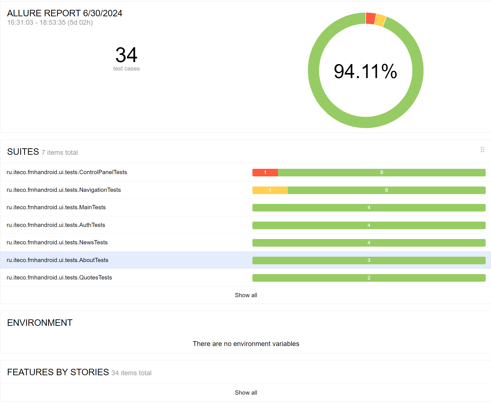
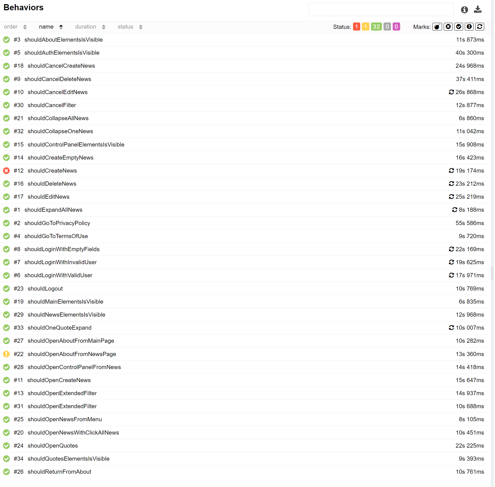

# Отчет о тестировании

## Количество тест-кейсов

В процессе тестирования приложения "Мобильный хоспис" было составлено 64 тест-кейса, из них 34 автоматизировано и реализовано. Для запуска автотестов применялся эмулятор Pixel 3 API 29.

Из 34 автотестов успешно пройдено 32 автотеста, 94,11%.

## Сравнение затраченного времени на тестирование приложения

* Ручное тестирование, с учетом составления чеклиста и тест-кейсов: 10 часов.
* Автоматизация тестов, с учетом написания кода: 67 часов.
* Среднее время прохождения тестов: 10 минут.
